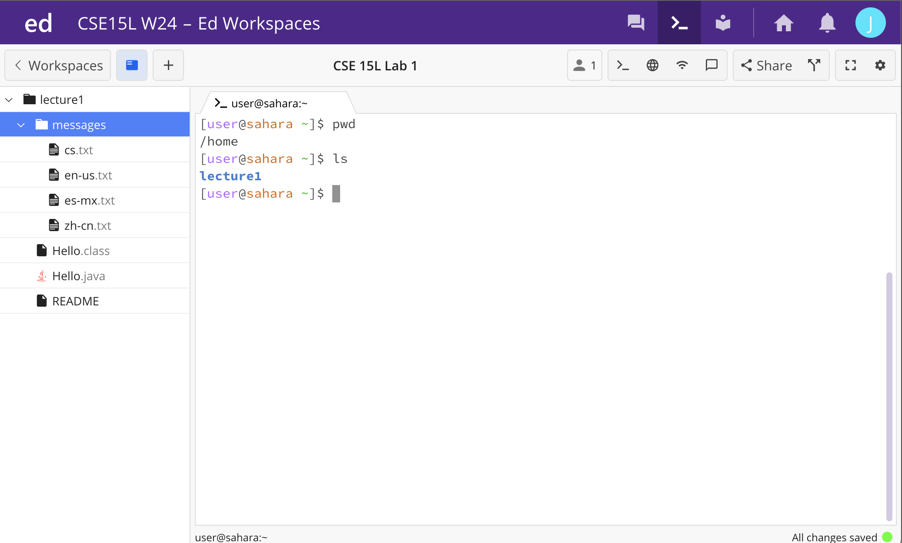
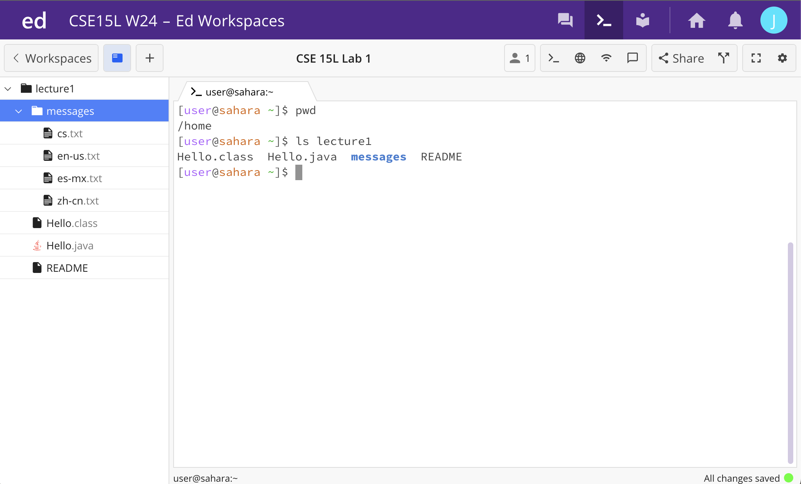

# Lab Report 1
*below is running the command of cd with a path to a directory, which is lecture1, as an argument*

working directory was from home.
after entering command ```cd lecture1```, it moved from home (user@sahara -) to (user@sahara -/lecture1), entering the directory lecture1. this is not an error.

*below is running the command of cd with a path to a text file, which is cs.txt as an argument*

working directory was from home.
after running the ```command cd cs.txt```, it said "no such file or directory". this would be an error as directories are folders that store information, such as files. to cd into a file would not be possible as text files do not store other files, therefore would not be considered a directory.

*below is running the command of cd with no arguments*

working directory was from home.
after running the command ```cd```, it does not have a specific directory path, bringing it back to the home directory. this is not an error.

*below is running the command of ls with no arguments*

working directory was from home.
after running the command ```ls```, it lists every folder in the working directory. in this case, the working directory was the home directory, listing lecture1 as the only folder. this is not an error.

*below is running the command of ls with a path to a directory, which is lecture1*

working directory was from home.
after running the command ```ls lecture1```, it listed the folders and files within lecture1. this is not an error.

*below is running the command of ls with a path to a file, which is messages*

working directory was from home.
this is not an error because after running the command ```ls lecture1/messages/cs.txt```, it reprinted the command. Because a text file does not contain other files, ```ls lecture1/messages/cs.txt``` can not list any other files.

*below is running the command cat with no arguments*

working directory was from home.
this is not an error because after running the command cat with no arguments, it listed nothing as there was no file listed to concatenate.

*below is running the command cat with a path to a directory, which is lecture1*

working directory was from home.
this is an error because after running the command cat lecture1, it stated that "lecture1: is a directory" as lecture1 contains multiple files and a directory, not like cd cs.txt where it was not able to run despite cs.txt being a file.

*below is running the command ```cat lecture1/Hello.java```*

working directory was from home.
this is not an error because after running the command ```cat lecture1/Hello.java```, it prints the contents within the Hello.java file.
