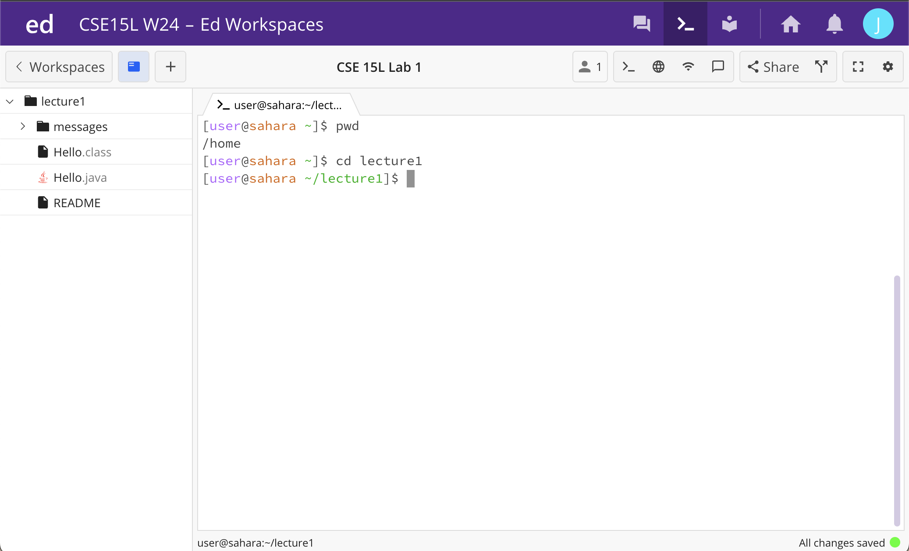

# Lab Report 1
*below is running the command of cd with a path to a directory, which is lecture1, as an argument*

after entering command cd lecture1, it moved from home (user@sahara -) to (user@sahara -/lecture1), entering the directory lecture1

*below is running the command of cd with a path to a file, which is cs.txt as an argument*

after running the command cd cs.txt, it said "no such file or directory". this would be an error as directories are folders that store information, such as files. to cd into a file would not be possible as files do not store other files, therefore would not be considered a directory.

*below is running solely the command of cd from the current location of the terminal*

after running the command cd, it does not have a specific directory path, bringing it back to the home directory.

*below is running the command of ls with no arguments*
