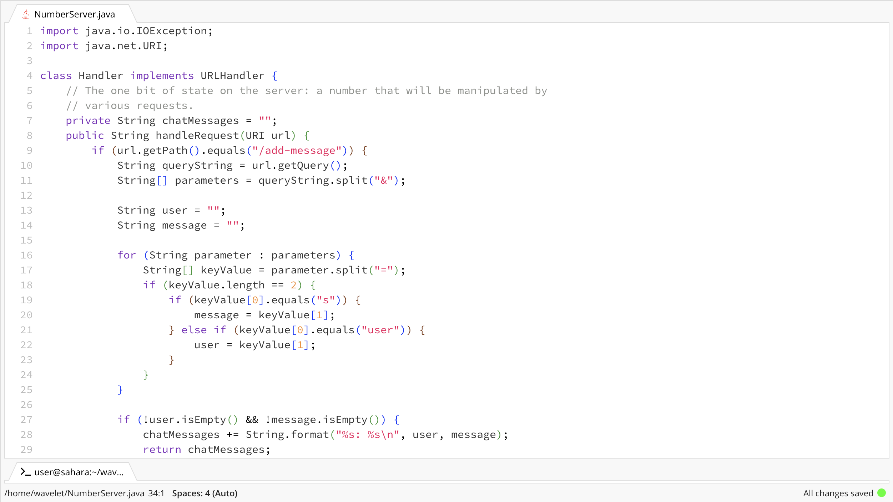
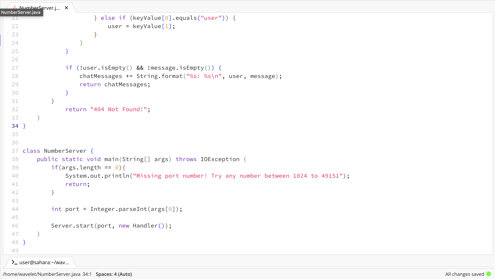
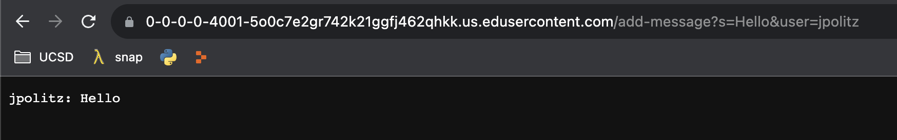
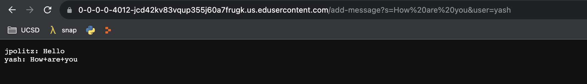
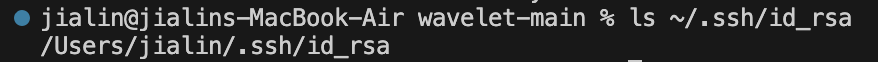
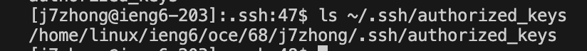
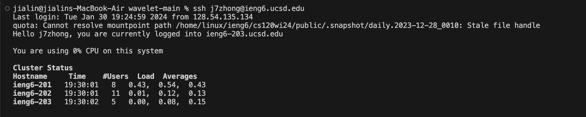

# Lab Report 2
<br> *Part 1*
<br> Below are screenshots of the code to ChatServer 
<br> 
<br> 

<br> Below are two ```/add-message``` on the webserver.
<br> 
<br> Method, handleRequest() and getQuery(), was called on.
<br> The relevant argument was ```URI url``` and relevant fields are ```String queryString```, ```String[] parameters```, ```String user```, and ```String message```.
<br> ```String queryString``` is dependent on ```URI url```, and ```String[] parameters```, ```String user```, ```String message``` depend on ```String queryString```. Once ```/add-message``` following different queries are added to ```URI url```, it changes the values to ```String[] parameters```, ```String user```, ```String message```, which changes the printed messages on the webserver. In this case, getQuery() got the value of ```String user``` "jpolitz" and the value of ```String message``` "Hello", and it printed "jpolitz: Hello".

<br> 
<br> Method, handleRequest() and getQuery(), was called on.
<br> The relevant argument was ```URI url``` and relevant fields are ```String queryString```, ```String[] parameters```, ```String user```, and ```String message```.
<br> ```String queryString``` is dependent on ```URI url```, and ```String[] parameters```, ```String user```, ```String message``` depend on ```String queryString```. Once ```/add-message``` following different queries are added to ```URI url```, it changes the values to ```String[] parameters```, ```String user```, ```String message```, which changes the printed messages on the webserver. In this case, getQuery() got the value of ```String user``` "yash" and the value of ```String message``` "How are you", which printed "yash: How+are+you".

<br>

*Part 2*
<br>Below is the absolute path to the private key.
<br> 
<br>
<br> Below is the absolute path to the public key.
<br> 
<br>
<br> Below is the terminal interaction.
<br> 
<br>

*Part 3*
<br> One thing I've learned throughout weeks 2 and 3 was how a URL has different parts. I learned with ```https://```, the ```s``` stands for secure and the domain is after ```https;//``` and ends with .org, .com, .edu, etc. How after ```/``` and before ```?``` is a path and after ```?``` is a query. 
