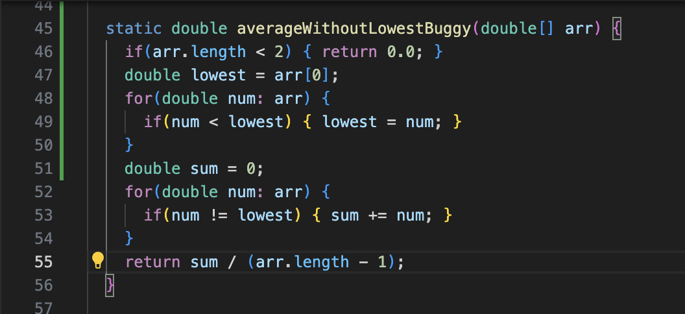
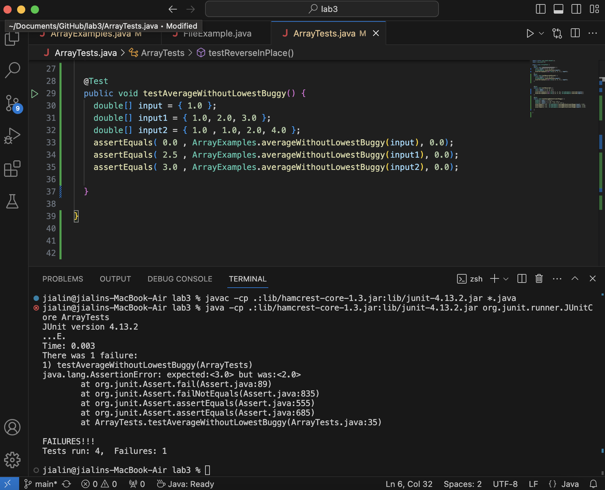

# Lab Report 3
<br> *Part 1*
<br>
<br> Below is the code for a buggy program.
<br> 
<br>
<br> A failure-inducing input for the buggy program
- ```double[] input2 = { 1.0 , 1.0, 2.0, 4.0 };```
- ```assertEquals( 3.0 , ArrayExamples.averageWithoutLowestBuggy(input2), 0.0);```  

An input that doesn't induce a failure
- ```double[] input1 = { 1.0, 2.0, 3.0 };```
- ```assertEquals( 2.5 , ArrayExamples.averageWithoutLowestBuggy(input1), 0.0);```

The symptom, as the output of running the tests
<br>   

<br> The bug  
Before:
```
static double averageWithoutLowestBuggy(double[] arr) {
          if(arr.length < 2) { return 0.0; }
          double lowest = arr[0];

          for(double num: arr) {
            if(num < lowest) { lowest = num; }
          }

          double sum = 0;
  
          for(double num: arr) {
            if(num != lowest) { sum += num; }
          }
          return sum / (arr.length - 1);
```
After:
```
static double averageWithoutLowest(double[] arr) {
        if(arr.length < 2) { return 0.0; }
        double lowest = arr[0];

        for(double num: arr) {
          if(num < lowest) { lowest = num; }
        }

        double sum = 0;
        double counter = 0;

        for(double num: arr) {
          if(num != lowest) { 
            sum += num; 
            counter +=1 ;
          }
        }
        return sum / (counter);
      }
```
The fix was adding a counter that wasn't connected to the length of the array. Because some of the arrays may have repeated lowest integers,
we needed to account for that. With the counter, the code will be able to keep track of the sum and number of integers without the repeated lowest integers.  

*Part 2: Researching Commands*  
<br> I chose ```find``` as my command.  
<br> command 1: ```-type```
<br> ```find technical -type d``` searches and lists out sub directories within the technical directory. It shows the path to those directories, making it useful for finding a specific directories.

```
jialin@jialins-MacBook-Air docsearch % find technical -type d
technical
technical/government
technical/government/About_LSC
technical/government/Env_Prot_Agen
technical/government/Alcohol_Problems
technical/government/Gen_Account_Office
technical/government/Post_Rate_Comm
technical/government/Media
technical/plos
technical/biomed
technical/911report
```
<br> command 2: ```-type```
<> ```find technical -type f``` searches lists out all the files within the technical directory. It shows the path to those files, making it useful for locating a specific file.

```
technical/plos/pmed.0020206.txt
technical/plos/pmed.0020212.txt
technical/plos/pmed.0020216.txt
technical/plos/journal.pbio.0030094.txt
technical/plos/journal.pbio.0020046.txt
technical/plos/pmed.0020028.txt
technical/plos/journal.pbio.0020052.txt
technical/plos/pmed.0020148.txt
technical/plos/pmed.0020160.txt
technical/plos/pmed.0010048.txt
technical/plos/pmed.0010060.txt
technical/plos/journal.pbio.0030137.txt
technical/plos/journal.pbio.0030136.txt
technical/plos/pmed.0010061.txt
technical/plos/pmed.0010049.txt
technical/plos/pmed.0020161.txt
technical/plos/journal.pbio.0020127.txt
technical/plos/pmed.0020149.txt
technical/plos/journal.pbio.0020133.txt
```
^there's more but chose to limit for the sake of space/formatting

<br> command 3: ```-d```
<br> ```find technical -d 1``` lists out one level below the diretory technical. In this case, it lists out the sub directories of technical. This limits the search depth, making it useful to avoid searching too deeply and focus within one level.
```
jialin@jialins-MacBook-Air docsearch % find technical -d 1
technical/government
technical/plos
technical/biomed
technical/911report
```
<br> I asked ChatGPT what path is required for this command.

<br> command 4: ```-d```
<br> ```find technical/goverment -d 1``` lists out one level below the subdirectory government, which is in the technical directory. Since government also has subdirectories, when this command line is called, it will list out the subdirectories within the government subdirectory. This is useful to scope out files or directories and perform targeted searches, avoiding unecessary repetition.

```
jialin@jialins-MacBook-Air docsearch % find technical/government -d 1
technical/government/About_LSC
technical/government/Env_Prot_Agen
technical/government/Alcohol_Problems
technical/government/Gen_Account_Office
technical/government/Post_Rate_Comm
technical/government/Media
```
<br> I asked ChatGPT what path is required for this command.

<br> command 5: ```-delete```
<br> ```find technical -type f -name "chapter-1.txt" -delete``` deletes the file named "chapter-1.txt" within the technical directory. This is useful as it allows for selective deletion, not having to delete massive files/directories at once.

<br> ```jialin@jialins-MacBook-Air docsearch % find technical -type f -name "chapter-1.txt" -delete```
<br> I asked ChatGPT what path is required and whether it returns anything when you use ```-delete```. 

<br> command 6: ```delete```
<br> ```find technical -type f -name "chapter-2.txt" -delete``` deletes the file named "chapter-2.txt" within the technical directory.

<br> ```jialin@jialins-MacBook-Air docsearch % find technical -type f -name "chapter-2.txt" -delete```
<br> I asked ChatGPT what path is required and whether it returns anything when you use ```-delete```. 

<br> command 7: ```-empty```
<br> ```find technical -type d -empty``` searches through directories and finds if there are any empty directories. This is useful to check if there are any miscellaneous directories without code/information.
<br> ```jialin@jialins-MacBook-Air docsearch % find technical -type d -empty```

<br> command 8: ```-empty```
<br> ```find technical -type f -empty``` searches through files and finds if there are any empty files. This is useful to check if there are any miscellaneous files without code/information.  
<br> ```jialin@jialins-MacBook-Air docsearch % find technical -type f -empty```


# Sources
<br> I used [Linux find command](https://www.computerhope.com/unix/ufind.htm) to find different commands to use with ```find```.
