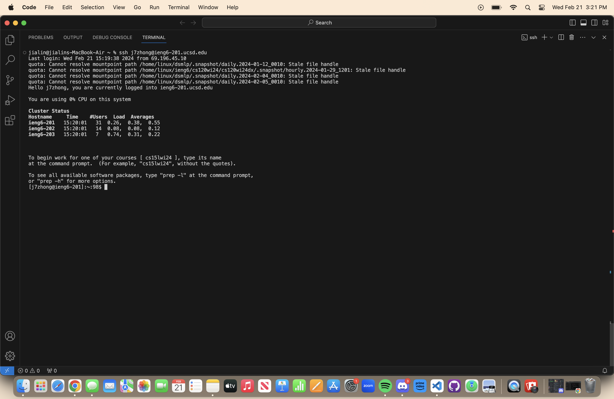
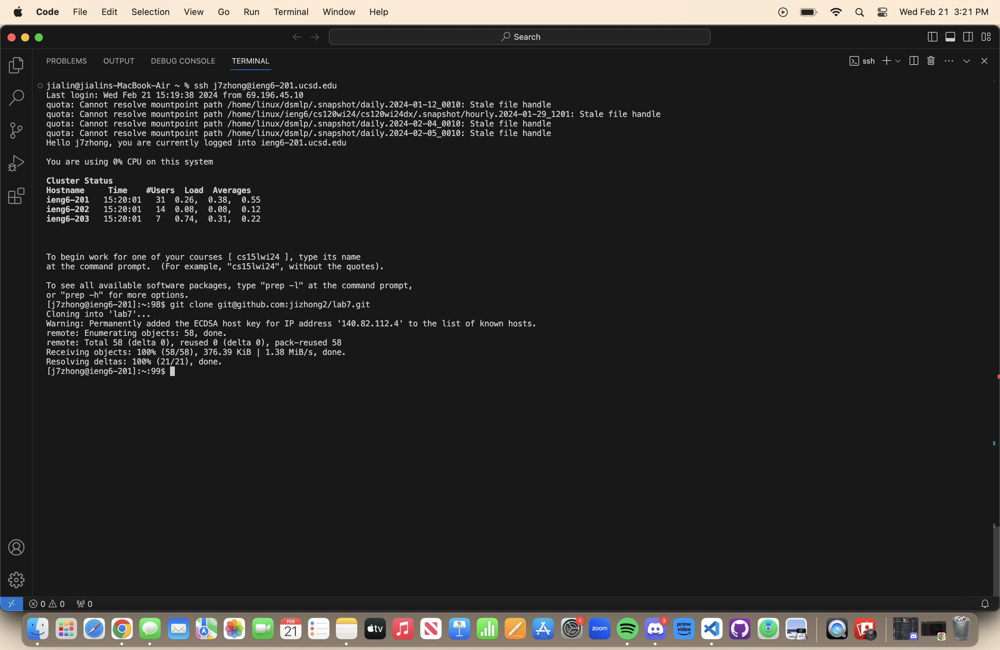
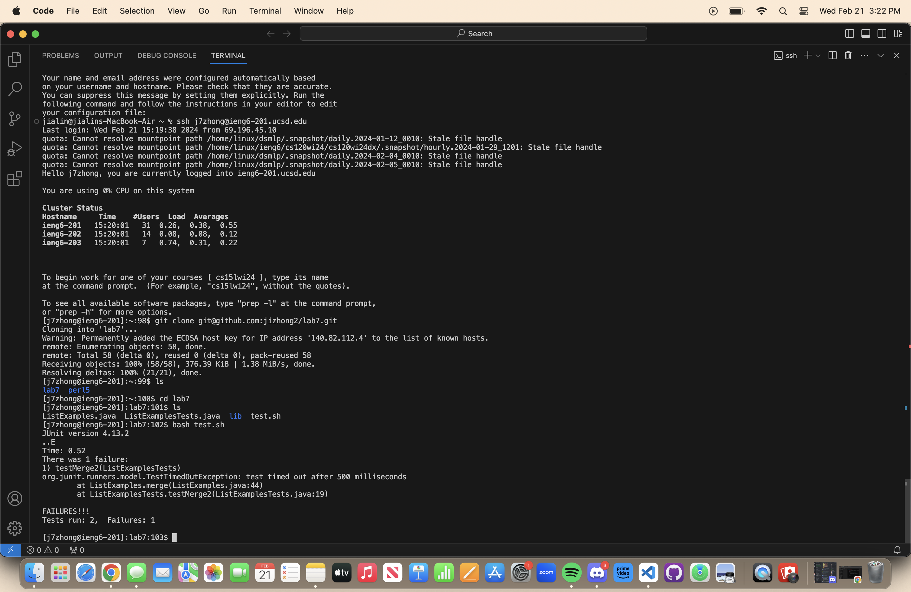
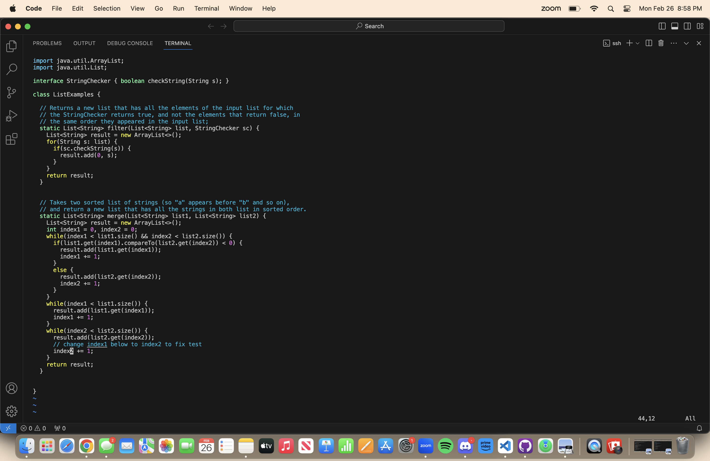
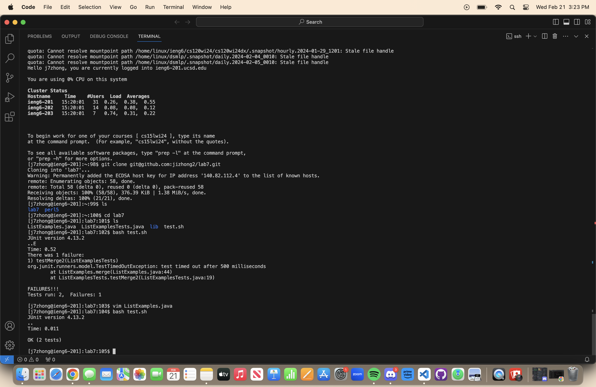
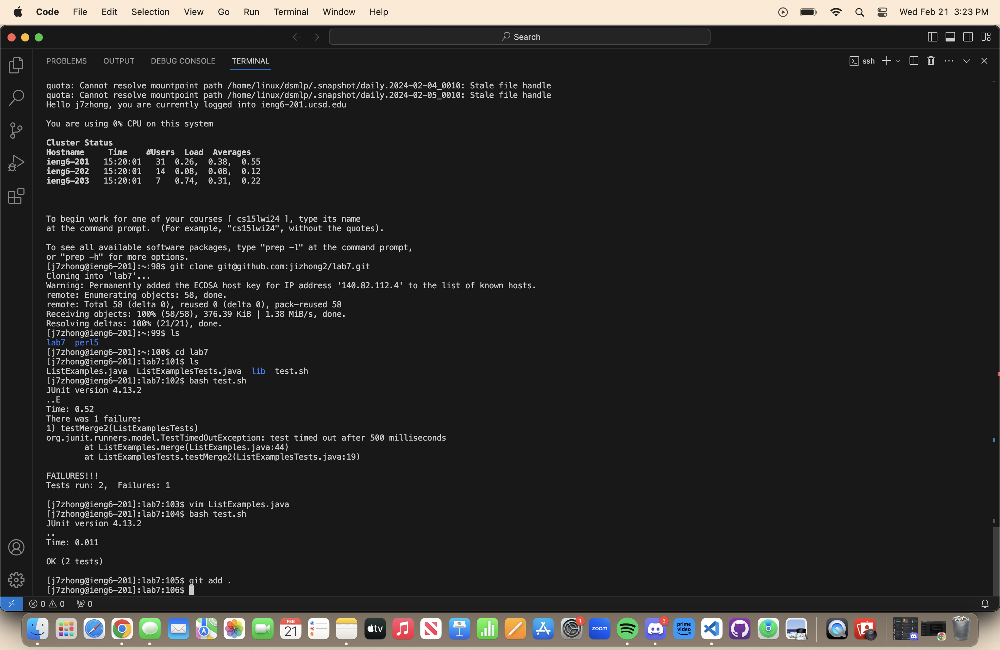
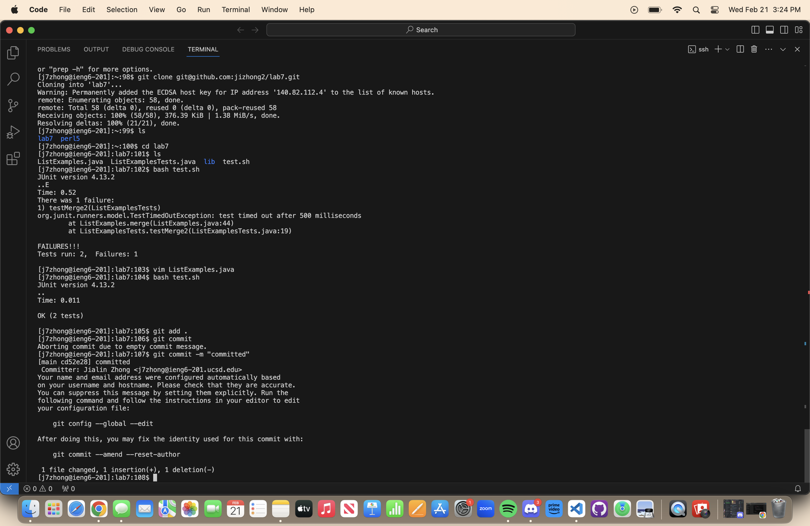
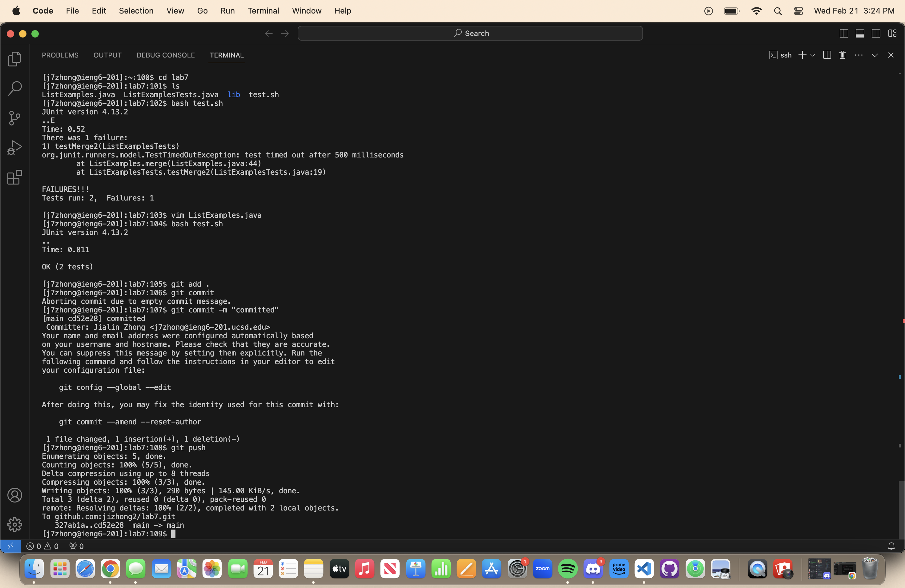
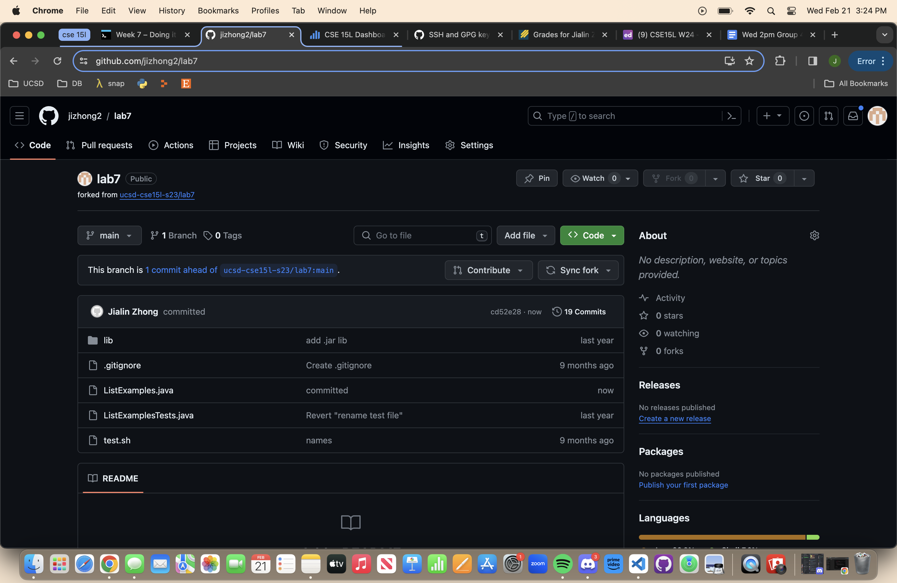

# Lab Report 4
<br> 4. Log into ieng6
<br> keys used are ```ssh j7zhong@ieng6-201.ucsd.edu```  to log into UCSD account and ```<Enter>``` to execute the command.
<br> 

<br> 5. Clone your fork of the repository from your Github account (using the SSH URL)
<br> keys used are ```git glone git@github.com:jizhong@/lab.git``` to clone the ssh link and ```<Enter>``` to execute the command. After execution, it successfully clones the repository to VSCode.
<br> 

<br> 6. Run the tests, demonstrating that they fail
<br> keys used are ```cd lab7``` ```<Enter>``` to change directories to lab7, ```ls``` ```<Enter>``` to out which file
to compile, and ```bash test.sh``` ```<Enter>``` to compile and run tests. The output will show us which tests ran and which failed, letting us know which file to edit.
<br> 

<br> 7. Edit the code file to fix the failing test
<br> keys used are ```vim ListExamples.java``` to enter the file that needs editing, ```i``` to start editing. Then, to move the cursor to get to the bug in the file starting from the top left corner, ```<down>``` was pressed around 43 times and ```<right>``` was pressed around 9 times, and found ```index1 += 1;``` under the comment telling me to change ```index1``` to ```index2```. Made the cursor fall on the ```1``` on ```index1``` and entered ```2``` to change the index number, ```Right``` to move the cursor, and ```Backspace``` to delete the 1. I pressed ```Esc``` to exit out of insert mode, and ```:wq!``` to save and quit. This will edit the file, save the edits, and exit out of the file with the correct code, allowing all tests to pass.
<br> 

<br> 8. Run the tests, demonstrating that they now succeed
<br> keys used are ```bash test.sh``` and ```<Enter>``` to execute the command. This compiles the test cases and shows that they ran successfully.
<br> 

<br> 9. Commit and push the resulting change to your Github account (you can pick any commit message!)
<br> keys used are ```git add .``` and ```<Enter>``` to add a change in the working directory to the staging area.
<br> 

<br>```git commit -m "committed"``` and ```<Enter>``` to capture a snapshot of the file's currently staged changes.
<br> 

<br> and ```git push``` and ```<Enter>``` to upload it to my repository.
<br> 

<br> Below is evidence that the push was successful.
<br> 


