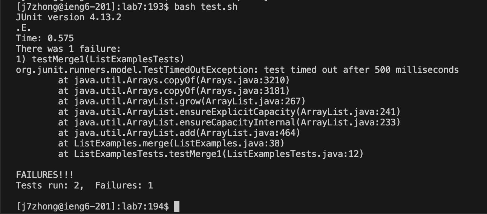
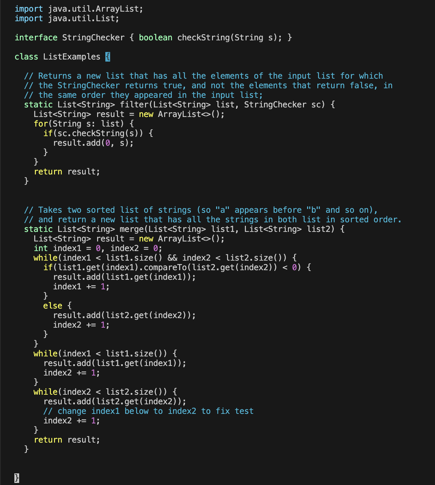
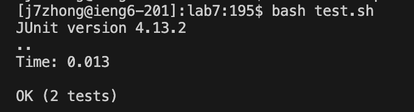
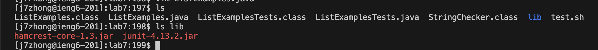

# Lab Report 4
<br> *Student Post*
<br> Hello, I'm having trouble with ListExamples.java. My test case keeps
failing due to a TestTimeOutException. I believe it stems from one of my while loop
conditions not incrementing correctly, making the while loop run forever. Attached are
screenshots of my code.
<br> 
<br> 

<br> *TA Response*
<br> Hello, it seems like you are incrementing the wrong variable in the second while loop.
Instead of incrementing ```index1```, which is a condition to stop the while loop,
you are incrementing ```index2```. To fix this bug, you want to change ```index2``` to ```index1```.

<br> *Student Response After Fix*
<br> Hi! After changing ```index2``` to ```index1``` in the second while loop, my test cases passed!
The bug happened because the while loop condition depended on ```index1``` incrementing, and because
I was accidentally incrementing ```index2```, ```index1``` never changed values. This made the while loop
continue to run forever, causing the TestTimeOutException.
due to ```index1``` not changing.
<br> 
<br> [Image](workedbashscript.png)

<br> *Set Up*
<br> 
<br> 
<br> Contents of each file before the bug fix
<br> ListExamples.java
```
import java.util.ArrayList;
import java.util.List;

interface StringChecker { boolean checkString(String s); }

class ListExamples {

  // Returns a new list that has all the elements of the input list for which
  // the StringChecker returns true, and not the elements that return false, in
  // the same order they appeared in the input list;
  static List<String> filter(List<String> list, StringChecker sc) {
    List<String> result = new ArrayList<>();
    for(String s: list) {
      if(sc.checkString(s)) {
        result.add(0, s);
      }
    }
    return result;
  }


  // Takes two sorted list of strings (so "a" appears before "b" and so on),
  // and return a new list that has all the strings in both list in sorted order.
  static List<String> merge(List<String> list1, List<String> list2) {
    List<String> result = new ArrayList<>();
    int index1 = 0, index2 = 0;
    while(index1 < list1.size() && index2 < list2.size()) {
      if(list1.get(index1).compareTo(list2.get(index2)) < 0) {
        result.add(list1.get(index1));
        index1 += 1;
      }
      else {
        result.add(list2.get(index2));
        index2 += 1;
      }
    }
    while(index1 < list1.size()) {
      result.add(list1.get(index1));
      index2 += 1;
    }
    while(index2 < list2.size()) {
      result.add(list2.get(index2));
      // change index1 below to index2 to fix test
      index1 += 1;
    }
    return result;
  }


}
```
<br> ListExamplesTests.java
```
import static org.junit.Assert.*;
import org.junit.*;
import java.util.*;
import java.util.ArrayList;


public class ListExamplesTests {
	@Test(timeout = 500)
	public void testMerge1() {
    		List<String> l1 = new ArrayList<String>(Arrays.asList("x", "y"));
		List<String> l2 = new ArrayList<String>(Arrays.asList("a", "b"));
		assertArrayEquals(new String[]{ "a", "b", "x", "y"}, ListExamples.merge(l1, l2).toArray());
	}
	
	@Test(timeout = 500)
        public void testMerge2() {
		List<String> l1 = new ArrayList<String>(Arrays.asList("a", "b", "c"));
		List<String> l2 = new ArrayList<String>(Arrays.asList("c", "d", "e"));
		assertArrayEquals(new String[]{ "a", "b", "c", "c", "d", "e" }, ListExamples.merge(l1, l2).toArray());
        }

}
```
<br> test.sh
```
javac -cp .:lib/hamcrest-core-1.3.jar:lib/junit-4.13.2.jar *.java
java -cp .:lib/hamcrest-core-1.3.jar:lib/junit-4.13.2.jar org.junit.runner.JUnitCore ListExamplesTests
```

<br> Full command line(s) to trigger the bug:
<br>```bash test.sh``` was ran to trigger the bug.
<br>
<br> A description of what to edit to fix the bug:
<br>To fix the bug, replace ```index2``` with ```index1``` in the second while loop so ```index1``` can increment, making the while loop stop running.

*Part 2 - Reflection*
<br>I didn't know most of the stuff taught in lab before, but learning how to create a webserver
and being able to print out conversations using the URL was very interesting. Also learning how to use
vim and bash scripts was pretty neat. Now, instead of running and compile every time I edit a line of code,
I just need to run bash [filename].sh, which saves time in the long run.
